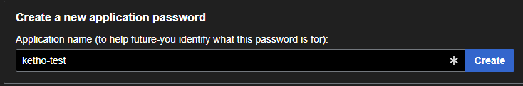
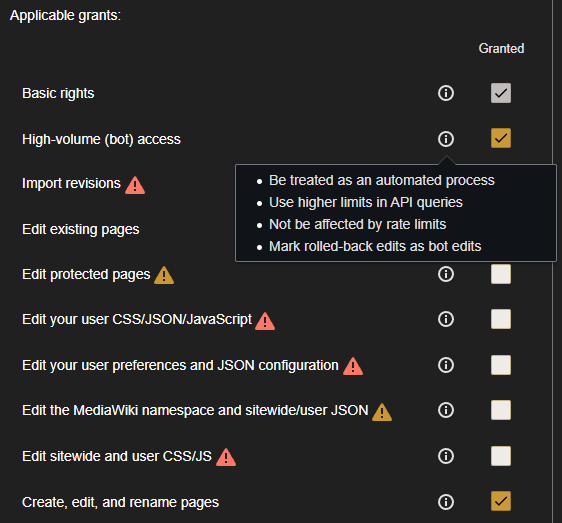
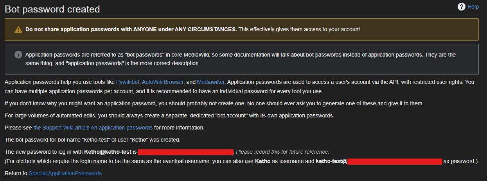

## Pywikibot
[Pywikibot](https://github.com/wikimedia/pywikibot) is useful for automating tasks on wikis like editing pages.

## Resources
- https://warcraft.wiki.gg/wiki/Warcraft_Wiki:Wiki_bots
- https://help.fandom.com/wiki/Bots
- https://en.wikipedia.org/wiki/Help:Creating_a_bot

### Application passwords
Pywikibot requires an application password (also known as bot password) which can be set in `user-password.py`
- https://warcraft.wiki.gg/wiki/Special:ApplicationPasswords
- https://www.mediawiki.org/wiki/Manual:Pywikibot/BotPasswords

First you create an application name.



Afterwards you will be able to set grants (user rights) for it. You minimally require the `Create, edit, and rename pages` grant. Having higher API limits would also be nice but is not required.



Here I created an application password for my own user account.



### Bot account (optional)
Bot accounts are only really required for high volume editing and is actually the preferred way by the wiki admins. You'd create a new user account (e.g. [KethoBot](https://warcraft.wiki.gg/wiki/Special:Contributions/KethoBot)), request the admins to give it the [bot role](https://warcraft.wiki.gg/wiki/Special:ListUsers?group=bot) and set up an application password for it.

## Setup
Create a virtual environment and install pywikibot.
```sh
sudo apt install python3-venv -y
python3 -m venv .venv
source .venv/bin/activate
pip install requests wikitextparser
pip install pywikibot
pip install beautifulsoup4
```

## Configuration
I put `user-config.py` and `user-password.py` in the root of the repository and gitignored them but there probably is a more proper way to do this.

### `user-config.py`
```py
family = 'warcraftwiki'
mylang = 'en'
usernames['warcraftwiki']['en'] = 'Ketho'
password_file = "user-password.py"
```

### `user-password.py`
```py
('Ketho', BotPassword('ketho-test', '<snip>'))
```

### `warcraftwiki_family.py`
I copied this file to `.venv/lib/python3.12/site-packages/pywikibot/families`
```py
from pywikibot import family

class Family(family.FandomFamily):
    name = 'warcraftwiki'
    domain = 'warcraft.wiki.gg'
    codes = {'en'}
```

## Usage
Test if it works by printing a page, for example [API_UnitLevel](https://warcraft.wiki.gg/wiki/API_UnitLevel)
```sh
python 'Pywikibot/hello-read.py'
```
```py
import pywikibot

site = pywikibot.Site("en", "warcraftwiki")
page = pywikibot.Page(site, "API_UnitName")

print(page.text)
```
```
{{wowapi|t=a|system=Unit}}
Returns the level of the unit.
 level = UnitLevel(unit)

==Arguments==
:;unit:{{apitype|string}} : [[UnitId]] - For example <code>"player"</code> or <code>"target"</code>

==Returns==
:;level:{{apitype|number}} - The unit level. Returns <code>-1</code> for boss units or hostile units 10 levels above the player (Level ??).
```

Login and try editing a page, for example https://warcraft.wiki.gg/wiki/User:Ketho/Sandbox
```sh
pwb login
python 'Pywikibot/hello-save.py'
```
```py
import pywikibot

site = pywikibot.Site("en", "warcraftwiki")
page = pywikibot.Page(site, "User:Ketho/Sandbox/bot")

page.text = "hello pywikibot"
page.save(summary = "Some test")
```
